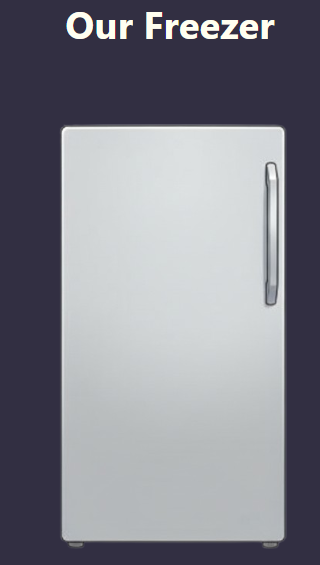

# Freezer Inventory App

Small React app to help organize what is stored in each drawer of a freezer. The app shows a clickable freezer image, lets you open a drawer, add items with dates, and search to see which drawer contains a given item.[file:54][file:65]

## Features

- Clickable freezer image with 5 drawers (image map + `<area>` elements).[file:65]  
- Drawer detail view with list of items (`name`, `dateAdded`).[file:54]  
- Add item inline form with auto‑focused input and generated `id` / date.[file:54]  
- Search across all drawers by item name, showing drawers and matching items.[file:65]  
- State stored in React (with optional Context + reducer and localStorage or backend persistence).[conversation_history:3][web:60]

## Tech Stack

- React (functional components + hooks).  
- React Router for `/freezer` and `/drawer` routes.[file:65]  
- Optional: React Context + `useReducer` for shared freezer state.[conversation_history:3]  
- Optional persistence: localStorage (single device) or Firebase / Supabase for multi‑device sync.[web:60][web:107]

# React + Vite

This template provides a minimal setup to get React working in Vite with HMR and some ESLint rules.

Currently, two official plugins are available:

- [@vitejs/plugin-react](https://github.com/vitejs/vite-plugin-react/blob/main/packages/plugin-react) uses [Babel](https://babeljs.io/) (or [oxc](https://oxc.rs) when used in [rolldown-vite](https://vite.dev/guide/rolldown)) for Fast Refresh
- [@vitejs/plugin-react-swc](https://github.com/vitejs/vite-plugin-react/blob/main/packages/plugin-react-swc) uses [SWC](https://swc.rs/) for Fast Refresh

## React Compiler

The React Compiler is not enabled on this template because of its impact on dev & build performances. To add it, see [this documentation](https://react.dev/learn/react-compiler/installation).

## Expanding the ESLint configuration

If you are developing a production application, we recommend using TypeScript with type-aware lint rules enabled. Check out the [TS template](https://github.com/vitejs/vite/tree/main/packages/create-vite/template-react-ts) for information on how to integrate TypeScript and [`typescript-eslint`](https://typescript-eslint.io) in your project.
